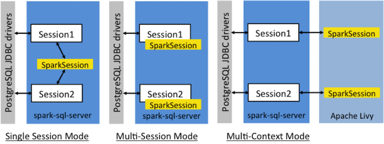
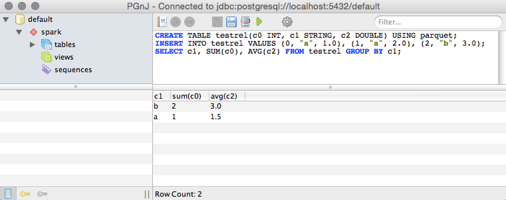

[](https://github.com/maropu/spark-sql-server/blob/master/LICENSE)
[](https://travis-ci.org/maropu/spark-sql-server)
<!---
[](https://coveralls.io/github/maropu/spark-sql-server?branch=master)
-->

A Spark SQL server based on the PostgreSQL V3 protocol.
For more information, see [SPARK-15816](https://issues.apache.org/jira/browse/SPARK-15816).
This Spark SQL server experimentally supports impersonation based on [Apache Livy](https://livy.incubator.apache.org/) that
[the Spark Thrift server](https://github.com/apache/spark/tree/master/sql/hive-thriftserver) in vanilla Apache Spark currently doesn't do.

## Run the Spark SQL JDBC/ODBC server

To start the JDBC/ODBC server, you need to check out this repository and run the following command
in the root directory:

    $ ./sbin/start-sql-server.sh --conf spark.sql.server.psql.enabled=true

This script accepts all `bin/spark-submit` command line options in Spark, plus options for the SQL server.
You may run `./sbin/start-sql-server.sh --help` for a complete list of all available options.
If you use `spark-2.3.x`, you can add the option below to install the JDBC/ODBC server:

    $ ./bin/spark-shell --packages maropu:spark-sql-server:0.1.6-spark2.3

Then, you run the commands to launch the server:

    scala> sql("SET spark.sql.server.psql.enabled=true")
    scala> sql("SET spark.sql.crossJoin.enabled=true")
    scala> org.apache.spark.sql.server.SQLServer.startWithContext(spark.sqlContext)

Now, you can use a PostgreSQL `psql` command to test the SQL JDBC/ODBC server:

    $ psql -h localhost -d default

If you have no `psql` command and you use the Amazon Linux AMI, you can run `sudo yum install postgresql95`
to install PostgreSQL client programs. Since the SSL mode of this `psql` command is enabled by default,
you need to turn off the SSL mode to connect the SQL server:

    $ psql postgresql://localhost:5432/default?sslmode=disable

## Use PostgreSQL JDBC drivers in Java

To connect the SQL server, you can use mature and widely-used [PostgreSQL JDBC drivers](https://jdbc.postgresql.org/).
You can get the driver, add it to a class path, and write code like;

```java
import java.sql.*;
import java.util.Properties;

public class JdbcTest {
  public static void main(String[] args) {
    try {
      // Register your PostgreSQL JDBC driver
      Class.forName("org.postgresql.Driver");

      // Connect to a 'default' database in the SPARK SQL server
      String dbName = "default";
      Properties props = new Properties();
      props.put("user", "maropu");
      Connection con = DriverManager.getConnection("jdbc:postgresql://localhost:5432/" + dbName, props);

      // Do something...
      Statement stmt = con.createStatement();
      stmt.executeQuery("CREATE TEMPORARY VIEW t AS SELECT * FROM VALUES (1, 1), (1, 2) AS t(a, b)").close();
      ResultSet rs = stmt.executeQuery("SELECT * FROM t");
      while (rs.next()) {
        System.out.println("a=" + rs.getInt("a") + " b=" + rs.getInt("b"));
      }
      rs.close();
      stmt.close();
      con.close();
    } catch (Exception e) {
      // Do error handling here...
    }
  }
}
```

This Spark SQL server is only tested by using v42.2.2 of [PostgreSQL JDBC drivers](https://jdbc.postgresql.org/download.html).

## Use the PostgreSQL libpq C library

You can also use [`libpq`](https://www.postgresql.org/docs/current/static/libpq.html)
to connect the SQL server from C clients:

```
#include <stdio.h>
#include <stdlib.h>
#include <libpq-fe.h>

static void exit_nicely(PGconn *conn) {
  PQfinish(conn);
  exit(1);
}

int main(int argc, char **argv) {
  // Connect to a 'default' database in the SPARK SQL server
  PGconn *conn = PQconnectdb("host=localhost port=5432 dbname=default");
  if (PQstatus(conn) != CONNECTION_OK) {
    exit_nicely(conn);
  }

  // Do something...
  PGresult *res = PQexec(conn, "SELECT * FROM VALUES (1, 1), (1, 2) AS t(a, b)");
  if (PQresultStatus(res) != PGRES_TUPLES_OK) {
    PQclear(res);
    exit_nicely(conn);
  }
  for (int i = 0; i < PQntuples(res); i++) {
    printf("a=%s b=%s\n", PQgetvalue(res, i, 0), PQgetvalue(res, i, 1));
  }

  PQclear(res);
  PQfinish(conn);
  return 0;
}
```

## Pandas DataFrame via JDBC

You can directly load SQL result data as Pandas DataFrame by using some libraries
(e.g., [psycopg2](http://initd.org/psycopg/) and [pg8000](https://github.com/mfenniak/pg8000));

    >>> import psycopg2
    >>> import pandas as pd
    >>> connection = psycopg2.connect("host=localhost port=5432 dbname=default user=maropu sslmode=disable")
    >>> df = pd.read_sql(sql="SELECT * FROM VALUES (1, 1), (1, 2) AS t(a, b);", con=connection)
    >>> df
       a  b
    0  1  1
    1  1  2

Note that you need to set `false` at `spark.sql.server.binaryTransferMode` for the `psycopg2` library.

## Available options

    $ ./sbin/start-sql-server.sh -h
    Usage: ./sbin/start-sql-server.sh [options] [SQL server options]

    SQL server options:
      --conf spark.sql.server.port=NUM                    Port number of SQL server interface (Default: 5432).
      --conf spark.sql.server.executionMode=STR           Execution mode: single-session, multi-session, or multi-context (Default: multi-session).
      --conf spark.sql.server.worker.threads=NUM          # of SQLServer worker threads (Default: 4).
      --conf spark.sql.server.binaryTransferMode=BOOL     Whether binary transfer mode is enabled (Default: true).
      --conf spark.sql.server.ssl.enabled=BOOL            Enable SSL encryption (Default: false).
      --conf spark.sql.server.ssl.path=STR                Keystore path.
      --conf spark.sql.server.ssl.keystore.passwd=STR     Keystore password.
      --conf spark.sql.server.ssl.certificate.passwd=STR  Certificate password.
      --conf spark.yarn.keytab=STR                        Keytab file location.
      --conf spark.yarn.principal=STR                     Principal name in a secure cluster.
      --conf spark.yarn.impersonation.enabled=BOOL        Whether authentication impersonates connected users (Default: false).

## Execution modes

You can select one of thee different isolation levels: `single-session`, `multi-session`(default), and `multi-context`(experimental).
In the `single-session` mode, all the sessions in the SQL server share a single `SparkSession`.
In the `multi-session` mode, each session has an independent `SparkSession` with isolated SQL configurations, temporary tables,
and registered functions, but shares an underlying `SparkContext` and cached data.
In the `multi-context` mode, each session has the `SparkSession` that
[Apache Livy](https://livy.incubator.apache.org/) launches on an independent JVM.



## GUI clients

You can also use some GUI clients (e.g., [PGnJ](http://thomasmango.com/projects/pgnj/));



Note that you need to set `false` at `spark.sql.server.binaryTransferMode` for the `PGnJ` client.

## Cursor modes

To enable a cursor mode on your JDBC driver, you make sure autocommit is off and you need to set fetch size
throught `Statement.setFetchSize` (See descriptions in [Chapter 5. Issuing a Query and Processing the Result](https://jdbc.postgresql.org/documentation/head/query.html#query-with-cursor));

```java
      // Make sure autocommit is off
      Connection con = DriverManager.getConnection("jdbc:postgresql://localhost:5432/" + dbName, props);
      con.setAutoCommit(false);

      // Turn use of the cursor on.
      Statement stmt = con.createStatement();
      stmt.setFetchSize(50);
      ResultSet rs = stmt.executeQuery("SELECT * FROM range(10000000)");
      while (rs.next()) {
        System.out.println("id=" + rs.getLong("id"));
      }
```

Also, you could set `spark.sql.server.incrementalCollect.enabled` for memory efficiency
when launching the SQL server. If enabled, the SQL server collects result data partition-by-parititon.

## Install user-defined optimizer rules

Spark has already implmented a lot of efficient optimization rules in Catalyst and the Spark community continues to
develop it now. In some usecases, domain-specific knowledge and rules could make Spark more efficient and so
it is useful to append user-defined optimizer rules in Catalyst. Spark has an injection point in
[SparkSessionExtensions](https://github.com/apache/spark/blob/a791c29bd824adadfb2d85594bc8dad4424df936/sql/core/src/main/scala/org/apache/spark/sql/SparkSessionExtensions.scala#L28) for that purpose.
To install them, you need to pass [a builder class to inject rules](./examples/extensions/src/main/scala/org/apache/spark/ExtensionBuilderExample.scala) in configurations below;

    $ ./sbin/start-sql-server.sh \
        --conf spark.jars=./assembly/extensions_2.11_2.3.1_0.1.7-spark2.3-SNAPSHOT.jar \
        --conf spark.sql.server.extensions.builder=org.apache.spark.ExtensionBuilderExample

<!--
## PostgreSQL syntax

The SQL server supports some of PostgreSQL dialect;

    $psql -h localhost -d default
    Type "help" for help.

    maropu=> CREATE TEMPORARY VIEW t AS SELECT id AS key, id :: TEXT AS value FROM generate_series(0, 20, 5);
    --
    (0 rows)

    maropu=> SELECT * FROM t WHERE value ~ '^1;
     key | value
    -----+-------
      10 | 10
      15 | 15
    (2 rows)
-->

## Authentication

### SSL encryption

To enable SSL encryption, you need to set the following configurations in `start-sql-server.sh`;

    $ ./sbin/start-sql-server.sh \
        --conf spark.sql.server.ssl.enabled=true \
        --conf spark.sql.server.ssl.keystore.path=<your keystore path> \
        --conf spark.sql.server.ssl.keystore.passwd=<your keystore password>

If you use self-signed certificates, you follow 3 steps below to create self-signed SSL certificates;

    // Create the self signed certificate and add it to a keystore file
    $ keytool -genkey -alias ssltest -keyalg RSA -keystore server.keystore -keysize 2048

    // Export this certificate from server.keystore to a certificate file
    $ keytool -export -alias ssltest -file ssltest.crt -keystore server.keystore

    // Add this certificate to the client's truststore to establish trust
    $ keytool -import -trustcacerts -alias ssltest -file ssltest.crt -keystore client.truststore

You set the generated `server.keystore` to `spark.sql.server.ssl.keystore.path` and add a new entry (`ssl`=`true`) in `Properties`
when creating a JDBC connection. Then, you pass `client.truststore` when running `JdbcTest`
(See [the PostgreSQL JDBC driver documentation](https://jdbc.postgresql.org//documentation/head/ssl-client.html) for more information);

    $ javac JdbcTest.java

    $ java -Djavax.net.ssl.trustStore=client.truststore -Djavax.net.ssl.trustStorePassword=<password> JdbcTest

### Kerberos supports

You can use the SQL server on a Kerberos-secure cluster.
To enable this, you need to set the following configurations in `start-sql-server.sh`;

    $ ./sbin/start-sql-server.sh \
        --conf spark.yarn.principal=<Kerberos principal> \
        --conf spark.yarn.keytab=<keytab location>

Then, you set a Kerberos identity (`kerberosServerName`) in `Properties` to connect the SQL server when creating a JDBC connection.
See [Connection Parameters](https://jdbc.postgresql.org/documentation/head/connect.html#connection-parameters) for more information.
Moreover, you can enable impersonation for Apache Hadoop by setting true at `spark.yarn.impersonation.enabled`.
See [a tutorial](./resources/impersonation/how-to-use-impersonation.md) for quick try.

<!--
## High availability

A high availability policy of the Spark SQL server is along with [stand-alone Master one](http://spark.apache.org/docs/latest/spark-standalone.html#high-availability);
by utilizing ZooKeeper, you can launch multiple SQL servers connected to the same ZooKeeper instance.
One will be elected “leader” and the others will remain in standby mode.
If the current leader dies, another Master will be elected and initialize `SQLContext` with given configurations.
After you have a ZooKeeper cluster set up, you can enable high availability by starting multiple servers
with the same ZooKeeper configuration (ZooKeeper URL and directory) as follows;

    $ ./sbin/start-sql-server.sh \
        --conf spark.sql.server.recoveryMode=ZOOKEEPER \
        --conf spark.deploy.zookeeper.url=<ZooKeeper URL> \
        --conf spark.deploy.zookeeper.dir=<ZooKeeper directory to store recovery state>

To support simple connection fail-over, PostgreSQL JDBC drivers can define multiple endpoints (host and port pairs)
in the connection url separated by commas.
See [Connection Fail-over](https://jdbc.postgresql.org/documentation/head/connect.html#connection-failover) for more information.
-->

## Run TPC-DS queries in Spark via the SQL server

You first need to generate test data for TPC-DS queries:

    $ git clone https://github.com/maropu/spark-tpcds-datagen.git
    $ ./bin/dsdgen --output-location /tmp/spark-tpcds-data

Then, launches the SQL server with a Spark standalone mode:

    $ ./sbin/start-sql-server.sh \
        --conf spark.master=local[*] \
        --conf spark.driver.extraJavaOptions=-XX:+UseG1GC \
        --conf spark.driver.memory=8g

Finally, runs TPC-DS queries against the SQL server:

    $ ./bin/run-tpcds-benchmark --data-location /tmp/spark-tpcds-data

[This benchmark code](./sql/tpcds/src/main/scala/org/apache/spark/sql/benchmark/TPCDSQueryBenchmark.scala)
is a good example about how to connect the SQL server with Postgre JDBC drivers.

## Bug reports

If you hit some bugs and requests, please leave some comments on [Issues](https://github.com/maropu/spark-sql-server/issues)
or Twitter([@maropu](http://twitter.com/#!/maropu)).

